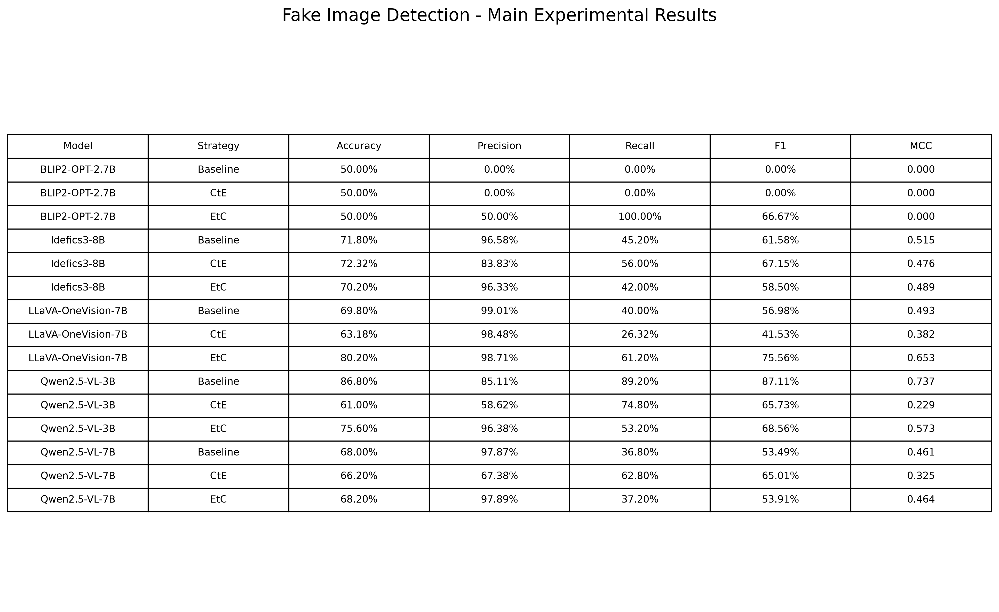

# Explainable Fake Image Detection with Multimodal Models Below 14B Parameters

This repository investigates explainable AI-generated image detection using multimodal large language models with fewer than 14 billion parameters.

The project compares multiple compact and medium-scale vision-language models under three reasoning strategies:

- Baseline
- Cause-to-Effect (CtE)
- Effect-to-Cause (EtC)

The focus is not only on detection accuracy, but also on whether reasoning strategy can compensate for limited model scale while maintaining practical computational cost.
## Model Scope and Design Choice

This project intentionally focuses on multimodal large language models with fewer than 14 billion parameters.

The purpose of this constraint is to evaluate models that are not only capable, but also practical to reproduce, deploy, and compare under realistic academic computing conditions. Very large multimodal models may achieve stronger performance, but they often require substantially more GPU memory, longer inference time, and higher computational cost.

By limiting the model scale to below 14B parameters, this project aims to:

- maintain a fair and reproducible experimental setting;
- reduce GPU memory and runtime requirements;
- enable evaluation across multiple models rather than relying on a single very large model;
- better reflect realistic deployment scenarios for research teams with limited computing resources;
- study whether reasoning strategies such as Cause-to-Effect (CtE) and Effect-to-Cause (EtC) can improve performance without simply increasing model size.

This design also allows the project to examine an important question:

> Can smaller and medium-scale multimodal models achieve competitive fake-image detection performance through better reasoning and prompting strategies, rather than relying purely on model scale?

The selected models therefore mainly fall within the 2.7B–8B range, while the broader project scope is restricted to models below 14B parameters.
## Models

The following models were evaluated:

- Qwen2.5-VL-3B-Instruct
- Qwen2.5-VL-7B-Instruct
- Idefics3-8B-Llama3
- LLaVA-OneVision-7B
- BLIP2-OPT-2.7B

## Dataset

A fixed balanced subset of 500 images from FakeBench was used:

- 250 real images
- 250 AI-generated images

The original dataset is not included in this repository.

## Prompting Strategies

### Baseline
The model directly predicts whether an image is REAL or AI-GENERATED.

### Cause-to-Effect (CtE)
The model first inspects visible image evidence and then predicts the final authenticity label.

### Effect-to-Cause (EtC)
The model first produces an authenticity prediction and then explains the visual evidence supporting that result.

## Evaluation Metrics

Detection performance is evaluated using:

- Accuracy
- Precision
- Recall
- F1-score
- Mean inference latency

## Experimental Hardware

Experiments were conducted on the UTS Cetus High Performance Computing cluster.

GPU:

- NVIDIA RTX PRO 6000 Blackwell
- 96 GB VRAM

## Main Results

The complete numerical results, including MCC and confusion-matrix counts, are available in:

`github_results/final_5models_with_mcc_confusion.csv`
## Key Observations

- Qwen2.5-VL-3B achieved the strongest overall baseline result, with 86.8% accuracy and 87.1% F1.
- LLaVA-OneVision-7B benefited substantially from the EtC strategy, improving from 69.8% baseline accuracy to 80.2%.
- Idefics3-8B performed best under the CtE strategy.
- Qwen2.5-VL-7B showed improved fake-image recall under CtE, although overall accuracy did not increase.
- BLIP2-OPT-2.7B showed degenerate prediction behaviour and was substantially weaker than the instruction-tuned multimodal models.
- Larger parameter count did not consistently lead to better fake-image detection performance.

## Runtime

Approximate end-to-end job runtime for the completed 500-image experiments:

| Model | Runtime |
|---|---:|
| Qwen2.5-VL-7B | 1h 07m |
| Idefics3-8B | 35m |
| LLaVA-OneVision-7B | 1h 02m |
| BLIP2-OPT-2.7B | 5m |
| Qwen2.5-VL-3B | Recorded in final runtime CSV |

Detailed runtime and GPU information is available in:

## Result Visualisations

### Accuracy Comparison

### F1 Score Comparison

### Inference Latency

## Confusion Matrices

Confusion matrices are shown for all five models under the three prompting strategies: **Baseline**, **Cause-to-Effect (CtE)**, and **Effect-to-Cause (EtC)**.

### Qwen2.5-VL-3B

| Baseline | CtE | EtC |
| --- | --- | --- |
|  |  |  |

### Qwen2.5-VL-7B

| Baseline | CtE | EtC |
| --- | --- | --- |
|  |  |  |

### Idefics3-8B

| Baseline | CtE | EtC |
| --- | --- | --- |
|  |  |  |

### LLaVA-OneVision-7B

| Baseline | CtE | EtC |
| --- | --- | --- |
|  |  |  |

### BLIP2-OPT-2.7B

| Baseline | CtE | EtC |
| --- | --- | --- |
|  |  |  |

